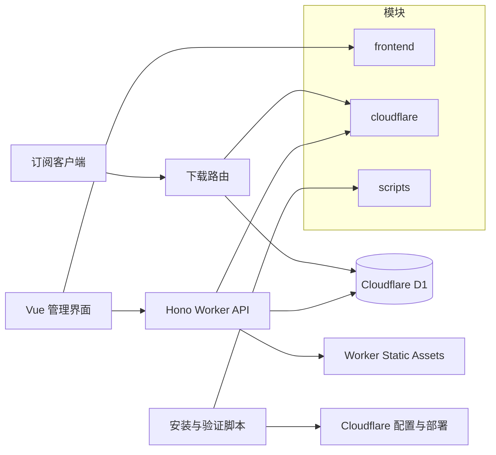

# Sub-Store Cloudflare：AI 上下文索引

## 项目愿景

在单个 Cloudflare Worker 中提供订阅源管理、节点处理、分流模板与客户端下载。运行时边界固定为 Workers Static Assets、Worker API、D1 和 Worker Secrets；不引入 KV、R2、Durable Objects、Queues 或 Cron。

## 架构总览



## 模块索引

| 模块 | 职责 | 说明 |
| --- | --- | --- |
| `frontend` | Vue 3 管理界面、路由、状态、国际化 | [frontend/AGENTS.md](frontend/AGENTS.md) |
| `cloudflare` | Hono Worker、D1 存储、订阅解析与下载输出 | [cloudflare/AGENTS.md](cloudflare/AGENTS.md) |
| `scripts` | 安装、私有配置校验、部署配置与发布检查 | [scripts/AGENTS.md](scripts/AGENTS.md) |

## 运行与开发

- 前置条件：Node.js 22+、Corepack 与 pnpm 11。
- 初始化：`corepack enable` 后运行 `pnpm run setup`。
- 本地开发：复制 `cloudflare/.dev.vars.example` 为本地忽略的 `cloudflare/.dev.vars`，运行 `pnpm run build:frontend`、`pnpm run dev`，默认访问 `http://localhost:8787/?token=dev-admin-token`。
- 构建：`pnpm run build`；前端产物由 Worker Static Assets 读取。
- 私有部署使用 `pnpm run install:cloudflare`，由安装器渲染本地 Wrangler 配置、迁移、部署、导入和 HTTP 验证。

## 测试策略

- 日常检查：`pnpm run check`（Worker 类型检查、前端 locale 检查与生产构建）。
- Worker 集成测试：`pnpm run check:tests`，使用 Cloudflare Vitest 池、真实 D1 migrations 和 Worker 入口。
- 发布门禁：`pnpm run check:release`；部署前可运行 `pnpm run deploy:dry-run`。
- 按变更选择 `check:installer`、`check:worker-contract`、`check:deploy-experience`、`check:docs` 或 `check:scripts`，避免无关的完整发布门禁。

## 编码规范

- 根与子包均为 ESM；TypeScript 模块遵守既有双引号、分号与显式类型风格，Vue 文件保持当前局部风格。
- 修改 Worker 对外行为时，同时核对 `cloudflare/src/types.ts`、前端目标列表、安装 schema 与 `scripts/check-worker-contract.mjs`。
- D1 schema 仅通过递增 migration 修改；内置模板与脚本由代码在构建时持有，不能将可执行脚本写入 D1 或从远程加载。
- 新增前端文案时同步 `frontend/src/locales/zh.ts` 与 `frontend/src/locales/en.ts`，并运行 `pnpm --dir frontend run check:locales`。

## AI 使用指引

- 先读取相关模块的 `AGENTS.md`，按最小影响范围修改；不要把私有订阅 URL、节点 URI、Token、D1 ID 或本地 seed SQL 写入已跟踪文件。
- 部署、迁移、设置 Worker Secret 等外部状态变更前必须取得用户明确授权；优先执行现有安装器而非拼接手工 Wrangler 步骤。
- 保持当前 Cloudflare-native 边界，避免为未被请求的功能添加存储、后台任务、日志或运行时脚本执行。
- `config/agent-setup.local.json`、`cloudflare/agent.seed.local.sql` 与 `cloudflare/wrangler.deploy.local.jsonc` 必须保持本地忽略；完成安装任务前检查 `git status --short`。

## 精简变更记录

- 2026-08-20：建立根及模块 AI 上下文索引；将 Claude 入口收敛为对同目录 `AGENTS.md` 的兼容导入。

## AI Agent Install Protocol

This file is the operating protocol for Codex, Claude Code, and similar local coding agents. Follow it when a user asks to install, deploy, configure, or verify this repository.

## Goal

Deploy Sub-Store Cloudflare into the user's Cloudflare account, import their subscription sources, create useful collections, and return ready-to-copy admin and download URLs.

## Product Boundary

- Keep the app Cloudflare-native and small: Workers Static Assets + Worker API + D1 + Worker Secrets.
- Use D1 for structured configuration. Do not switch to R2/KV/Durable Objects/Queues/Cron/Pages unless the user explicitly changes the architecture and the code is updated for it.
- The public data model is `sources`, `collections`, `templates`, `filters`, `settings`, `sourceIds`, scoped `download_grants`, and bounded `recycle_bin` entries.
- Treat upstream Sub-Store as a reference for retained source, collection, filter, template, preview, backup/restore, and download workflows only.
- Do not add files, Gist sync, public sharing, unbounded archives, runtime-evaluated scripts, logs, queues, cron, or artifact features during install or cleanup work. Build-time bundled Filter / Operator scripts, scoped download grants, and the bounded configuration recycle bin are supported through the existing pipeline.

## Deployment Paths

There are two supported install paths:

1. **Deploy to Cloudflare button** for ordinary open-source users.
   - Uses root `wrangler.jsonc`.
   - Uses root `package.json` `build` and `deploy` scripts.
   - Cloudflare provisions D1 and asks the user for Worker secrets.
   - Does not import private sources from local files.
2. **Agent / CLI installer** for users who want imported sources and collections.
   - Write `config/agent-setup.local.json`.
   - Run `pnpm run install:cloudflare`.
   - Let the installer create or reuse D1, render local Wrangler config, set secrets, migrate, deploy, seed, and verify.

Prefer the installer over manually running every deployment command.

For a human empty install, `pnpm run install:quick` may deploy first and let the user configure in the web UI. Do not use quick mode when an Agent was asked to import Sources or Collections. A non-interactive installer run without `config/agent-setup.local.json` must stop before deployment.

## Privacy Rules

- Never commit subscription URLs, node URIs, admin tokens, download tokens, database ids from private deployments, or generated seed SQL that contains user data.
- Put user-specific setup data in `config/agent-setup.local.json`.
- Generated local SQL goes to `cloudflare/agent.seed.local.sql`.
- Deployment-specific Wrangler config goes to `cloudflare/wrangler.deploy.local.jsonc`.
- These local paths are ignored by git.
- Before finishing, run `git status --short` and verify no private local file is tracked.

## One-Shot Prompt

The user can start with:

```text
Follow AGENTS.md and agent/SKILL.md in this repository. Deploy this Sub-Store Cloudflare project to my Cloudflare account. Ask me only for missing inputs, write config/agent-setup.local.json, run pnpm run install:cloudflare, and give me the final admin URL plus collection download URLs.
```

The same prompt is available in `agent/install.prompt.md`.

## Required Inputs

Ask only for missing inputs. Prefer reasonable defaults when the user does not care.

- Cloudflare login state: whether `wrangler whoami` succeeds.
- Worker name: default `sub-store-cloudflare`.
- Domain mode:
  - `workers.dev` only.
  - custom admin domain.
  - custom admin domain plus separate download domain.
- D1 database:
  - create or reuse `sub-store-cloudflare`, or use an explicit database id.
- Admin token and download token:
  - user-provided, env-provided, or generated locally.
- Sources:
  - remote subscription URLs.
  - local node text such as `vless://`, `trojan://`, `ss://`, `vmess://`.
- Collections:
  - collection ids and names.
  - which sources each collection includes.
  - `sourceIds: []` means all enabled sources; list ids to pin a collection to specific sources.
- Rule template:
  - read `config/rule-presets.json`.
  - default to `acl4ssr-mihomo`.
- Filters:
  - default collection filters: `dedupe-by-endpoint`, `sort-by-name`.
  - provider-info cleanup: `clean-provider-nodes`.
  - ask before using region include filters such as `hk-jp-sg-us-only`.
- Build-time scripts:
  - use public built-ins for ordinary installs.
  - put personal manifests in `config/script-plugins.local.json` and code in `config/scripts.local/`.
  - never store or execute script source from D1, the browser, or a remote URL.

## Workflow

1. Inspect the repo:
   - `git status --short`
   - `cat README.md`
   - `cat docs/deployment.md`
   - `cat docs/ai-agent-install.md`
   - `cat agent/SKILL.md`
   - `cat config/agent-setup.schema.json`
   - `cat config/rule-presets.json`
2. Prepare private setup:
   - Copy `config/agent-setup.example.json` to `config/agent-setup.local.json` if needed.
   - Fill `sources`, `collections`, optional custom `templates`.
   - Use 1-64 lowercase letters, numbers, underscores, or hyphens for record ids.
   - Prefer `filterPresetIds` from `config/rule-presets.json` for common filters.
   - Validate with `pnpm run seed:validate`.
   - Do not rely on the installer to deploy `config/agent-setup.example.json`; missing non-interactive setup is a handoff state.
3. Deploy with one command:
   - `pnpm run install:cloudflare`
4. Verify installer output:
   - admin URL works.
   - `/api/env`, `/api/templates`, `/api/sources`, `/api/collections` are verified.
   - `/api/link/collection/<id>` and `/download/collection/<id>/mihomo` are verified when collections exist.
5. Finish with:
   - final admin URL.
   - collection download URLs for Mihomo and any requested targets.
   - sources/collections summary.
   - `git status --short` privacy check summary.

## Cloudflare Missing States

If the user does not have a Cloudflare account, say clearly:

```text
This project requires a Cloudflare account because it runs on Workers + D1. I can prepare the local setup, but deployment requires Cloudflare. Create an account, then run:
pnpm --dir cloudflare exec wrangler login
pnpm run install:cloudflare
```

If Wrangler is not logged in, ask the user to run:

```bash
pnpm --dir cloudflare exec wrangler login
```

If the agent cannot connect to Cloudflare, stop at handoff:

```text
Cloudflare is not reachable from this environment. I prepared the local setup. Resume with:
pnpm run install:cloudflare
```

Do not claim deployment success until HTTP verification passes.

## Template Guidance

- `acl4ssr-mihomo`: recommended default for most users.
- `acl4ssr-mihomo-no-emoji`: same ACL4SSR routing style with plain group names.
- `mihomo-basic`: small and easy to inspect.
- `loyalsoldier-whitelist`: direct-first whitelist style.
- `loyalsoldier-blacklist`: proxy-first blacklist style.
- `ai-streaming-mihomo`: useful when AI, streaming, Telegram, and GitHub routing matters.

## Filter Guidance

Common starter filters:

```json
[
  { "type": "exclude", "field": "name", "pattern": "官网|剩余|流量|过期|倍率" },
  { "type": "dedupe", "fields": ["server", "port"] },
  { "type": "sort", "direction": "asc" }
]
```

Ask before adding aggressive include filters, because they can remove valid nodes.

## 索引状态
- 上次索引：2026-08-20T12:14:27Z（@6c4f461）
- 基线提交：6c4f4616308826a4bf4b72d091dfc0c5cc6408f0
- 已知缺口：无
- 扫描进度：已完成
